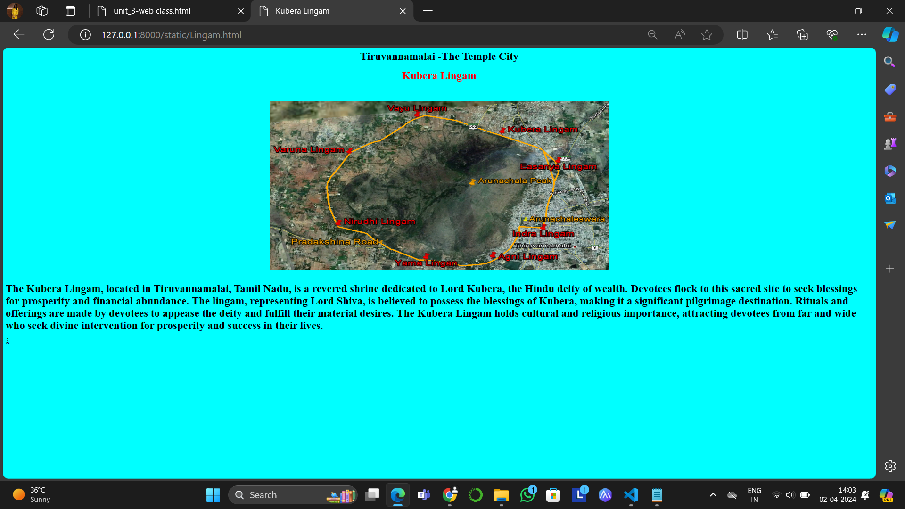

# Ex04 Places Around Me
## Date: 25.03.2024

## AIM
To develop a website to display details about the places around my house.

## DESIGN STEPS

### STEP 1
Create a Django admin interface.

### STEP 2
Download your city map from Google.

### STEP 3
Using ```<map>``` tag name the map.

### STEP 4
Create clickable regions in the image using ```<area>``` tag.

### STEP 5
Write HTML programs for all the regions identified.

### STEP 6
Execute the programs and publish them.

## CODE
```
doremon.html

<html>
    <head>
        <title> Tiruvannamalai </title>
    </head>
<body>
    <h1 align="center"><b>Tiruvannamalai -The Temple City</b><h1> 
    <h2 align="center">KRITHIGA U(212223240076)</h2>
<center>
    
    <map name="image-map">
    <area target="" alt="Tvm Samudiram Eri" title="Tvm Samudiram Eri" href="samudiram.html" coords="531,672,614,621" shape="rect">
    <area target="" alt="Shivalaya Arunachala" title="Shivalaya Arunachala" href="shivalaya.html" coords="373,253,35" shape="circle">
    <area target="" alt="Arunachaleswar Temple" title="Arunachaleswar Temple" href="Arunachaleswar.html" coords="912,484,872,482,870,425,914,423,949,452" shape="poly">
    <area target="" alt="Kubera Lingam" title="Kubera Lingam" href="Lingam.html" coords="844,166,29" shape="circle">
    <area target="" alt="Nellipet" title="Nellipet" href="Nellipet.html " coords="1315,122,1472,161" shape="rect">
</center>
</map>
</body>
</html>

Arunachaleswar.html

<html>
     <head>
         <title>Arunachaleswar Temple</title>
     </head>
     <body bgcolor="black">
        <font color="white">
        <h1 align="center"><b>Tiruvannamalai -The Temple City</b></h1>
        <h1 align="center"><b>Arunachaleswar Temple</b></h1>
        </font>
        <br>
        <br>
        <center>
        
        </center>
        <br>
        <br>
        <h1><font color="white">
            The Arunachaleswar Temple, situated in Tiruvannamalai, Tamil Nadu, is one of the largest and oldest Shiva temples in India.
            Dedicated to Lord Shiva, it stands at the foot of the sacred Arunachala Hill.
            The temple's architecture showcases intricate Dravidian style, adorned with ornate carvings and towering gopurams (gateway towers).
            Devotees flock here to pay homage to Lord Shiva and seek spiritual enlightenment.
            The temple complex encompasses various shrines, tanks, and mandapams (halls) reflecting the rich cultural heritage of the region.
            Arunachaleswar Temple hosts vibrant festivals like Karthigai Deepam, attracting pilgrims and tourists from across the globe.
        </font>
        </h1>
         </body>
</html>

samudiram.html

<html>
     <head>
         <title>SAMUDIRAM ARI</title>
     </head>
     <body bgcolor="pink">
        <h1 align="center"><b>Tiruvannamalai -The Temple City</b></h1>
        <font color="blue">
        <h1 align="center"><b>SAMUDIRAM ARI</b></h1>
        </font>
        <br>
        <br>
        <center>
        
        </center>
        <br>
        <h1>
            Samudram Eri, nestled in Thiruvannamalai, Tamil Nadu, encircles the revered Arunachala Hill.
            This sacred reservoir holds deep religious significance, drawing devotees and tourists seeking spiritual solace and natural beauty.
            Surrounded by lush greenery, it offers a serene ambiance for meditation and reflection.
            The reservoir's tranquil waters reflect the spiritual aura of the area, enhancing its cultural significance.
            Pilgrims often visit to perform rituals and seek blessings.
            Beyond its religious importance, Samudram Eri serves as a picturesque spot for leisurely strolls and picnics, attracting visitors year-round.
            It stands as a symbol of harmony between nature and spirituality, enriching the region's cultural heritage.</h1>
        
     </body>
</html>

shivalaya.html

<html>
     <head>
         <title>shivalaya</title>
     </head>
     <body bgcolor="sky blue">
        <h1 align="center"><b>Tiruvannamalai -The Temple City</b></h1>
        <font color="white">
        <h1 align="center"><b>Shivalaya Arunachala Resort</b></h1>
        </font>
        <br>
        <br>
        <center>
        
        </center>
        <br>
        <br>
        <h1><font color="black">
            Shivalaya Arunachala is a renowned hotel nestled in Tiruvannamalai, Tamil Nadu, offering a serene retreat for travelers.
            Surrounded by the majestic Arunachala Hill, it provides a tranquil ambiance for guests seeking relaxation and rejuvenation.
            The hotel's architecture reflects traditional South Indian charm, while its modern amenities ensure a comfortable stay.
            Shivalaya Arunachala is known for its warm hospitality and personalized service, catering to the needs of both leisure and business travelers.
            With its convenient location and peaceful atmosphere, it serves as an ideal base for exploring the spiritual and cultural treasures of Tiruvannamalai.
        </font>
        </h1>
         </body>
</html>

Lingam.html

<html>
     <head>
         <title>Kubera Lingam</title>
     </head>
     <body bgcolor="cyan">
        <h1 align="center"><b>Tiruvannamalai -The Temple City</b></h1>
        <font color="red">
        <h1 align="center"><b>Kubera Lingam</b></h1>
        </font>
        <br>
        <br>
        <center>
        
        </center>
        <br>
        <h1>
            The Kubera Lingam, located in Tiruvannamalai, Tamil Nadu, is a revered shrine dedicated to Lord Kubera, the Hindu deity of wealth.
            Devotees flock to this sacred site to seek blessings for prosperity and financial abundance.
            The lingam, representing Lord Shiva, is believed to possess the blessings of Kubera, making it a significant pilgrimage destination.
            Rituals and offerings are made by devotees to appease the deity and fulfill their material desires.
            The Kubera Lingam holds cultural and religious importance, attracting devotees from far and wide who seek divine intervention for prosperity and success in their lives.</h1>
        
     </body>
</html>

Nellipet.html

<html>
     <head>
         <title>shivalaya</title>
     </head>
     <body bgcolor="grey">
        <h1 align="center"><b>Tiruvannamalai -The Temple City</b></h1>
        <font color="white">
        <h1 align="center"><b>Nellipet</b></h1>
        </font>
        <br>
        <br>
        <center>
        
        </center>
        <br>
        <br>
        <h1>
            Nellipet is a small town found in the google map.It is located in the north-east part of the main TVMalai.
            <br>
            There is no much information available about it here !!It will soon be updated..
        </h1>
    </body>
</html>
```
## OUTPUT
.png>)





## RESULT
The program for implementing image maps using HTML is executed successfully.
